<h3 align="center">
    

<FONT SIZE=3>APICodigo de Athena</FONT>
</h3>

# Intro
<i align = "right">
Código para control y monitoreo de temperaturas en sistema ECMO para corazón
</i>

---

<details>
  <summary>Índice</summary>
  <ol>
    <li>
      <a href="#comenzando">Comenzando 🚀</a>
    </li>
    <li>
      <a href="#pre-requisitos">Pre-Requisitos 📋</a>
      <ul>
        <li><a href="#requisitos-desarrollador">Requisitos Desarrollador 💻</a></li>
        <li><a href="#requisitos-usuario">Requisitos Usuario 👨‍🦱</a></li>
      </ul>
    </li>
    <li><a href="#instalación">Instalación 🔧</a></li>
    <li>
      <a href="#pruebas">Pruebas 🔩</a>      
      <ul>
        <li><a href="#pruebas-software">Pruebas Software 👨‍💻</a></li>
        <li><a href="#pruebas-hardware">Pruebas Hardware 🔌</a></li>
      </ul>
    </li>
    <li><a href="#diagramas">Diagramas 📚</a></li>
    <li><a href="#despliegue">Despliegue 📦</a></li>
    <li><a href="#construcción">Construido con</a></li>
    <li><a href="#versionado">Versionado 📌</a></li>
    <li><a href="#wiki">Wiki 📖</a></li>
    <li><a href="#autores">Autores 🖋</a></li>
    <li><a href="#licencia">Licencia 📄</a></li>
    <li><a href="#expresiones-de-gratitud">Expresiones De Gratitud 🎁</a></li>
  </ol>
</details>

<p align="right">(<a href="#intro">Inicio</a>)</p>

## Comenzando 🚀          
<div align="left">
  <a href = "https://github.com/ThunderGer23/APImg">
    
  </a>
  <i>click para obtener el código de la API</i>
</div>

<p align="right">(<a href="#intro">Inicio</a>)</p>

### Pre-requisitos 📋

_Conocimientos intermadios en bases de datos, servidores, microservicios y python. Además del manejo de entornos virtuales con las siguientes instalaciones_


#### Requisitos Desarrollador 💻

_Debe contar con el siguiente conjunto de herramientas instaladas_

- [ ] Python
- [ ] Editor de texto/IDE
- [ ] MongoDB
- [ ] Postman

_Con lo anterior en mente es importante mencionar que se recomienda la integración de un entorno virtual para el desarrollo de nuevas funcionalidades dentro de la API, ya que pudiera existir el caso en el que alguna instalación ajena dentro del equipo produzca inconvenientes con la integración de nuestro software._

**Comandos a ejecutar en la terminal:**
      
      > pip install virtualenv
      > python -m venv APImg
      > cd APImg/Scripts/activate
      > cd ../..
      > pip install Fastapi uvicorn pymongo


#### Requisitos Usuario 👨‍🦱

_Se hace caso omiso de este apartado puesto que no debería haber intervención alguna por parte de usuarios finales o terceros ajenos al desarrollo del proyecto._

<p align="right">
  (<a href="#requisitos-desarrollador">Requisitos Desarrollador</a>)
  (<a href="#requisitos-usuario">Requisitos Usuario</a>)
  (<a href="#intro">Inicio</a>)
</p>

### Instalación 🔧

_Con nuestro entorno virtual creado y en ejecución mencionado en el punto anterior podemos proceder a ejecutar nuestro proyecto con los siguientes comandos_

_**Dentro de la carpeta principal de la API ejecutar:**_

      > uvicorn app:app

_El comando anterior levantará nuestro servidor para comenzar a trabajar, sin embargo lo realizará con una configuración predeterminada y bastante deficiente para un constante desarrollo de nuevas funcionalidades e integraciones al sistema, por lo cual se recomienda utilizar la siguiente adición de parametros._

      > uvicorn app:app --reload

_Haciendo que nuestro servidor se reinicie cada que detecte algún cambio dentro de nuestro código de ruteo._
_Adicional a esto es posible adicionar mayor cantidad de parametros como el host, port, entre otros._

      > uvicorn app:app --reload --host: <param> --port: <param>

<p align="right">(<a href="#intro">Inicio</a>)</p>


## Pruebas 🔩

_De manera adicional se incluiran archivos de la arquitectura y funcionamiento del sistema, así como un conjunto de datos que puede utilizar para realizar las pruebas pertinentes del sistema._

#### Pruebas Unitarias 👨‍💻

_El uso de pruebas unitarias dentro del proyecto nos permite detectar errores dentro de cada funcionalidad del sistema, son de gran ayuda a la hora de intentar agregar una nueva funcionalidad así como ahorrar tiempo al momento de testear el sistema_.


Primero es necesario crear un entorno virtual con el siguiente comando en una terminal **CMD**:

<h5 align="center"><code>python -m venv "nombre del entorno virtual"</code></h5>

Una vez que nuestro entorno virtual este creado debemos ponerlo en marcha; primero entratemos hasta la carpeta _Scripts_

<code>cd .\\"nombre del entorno virtual"\Scripts</code>

Ya dentro del directorio escribimos lo siguiente en la terminal

<h5 align="center"><code>activate.bat </code></h5>

Para confirmar que el entorno virtual esta encendido debe aparecernos entre parentesis el nombre que le asignamos a nuestro entorno virtual seguido de la ruta como se muestra en este ejemplo

```
(nombre del entorno virtual) C:\Users\toled\Documents\APIText>
```

Como ya confirmamos que nuestro entorno virtual esta encendido procederemos a instalr las herramientas necesarias para poder usar la API (estas herramientas y sus versiones estan en el documento <a href="https://github.com/ThunderGer23/APICita/blob/master/requirements.txt">**requirements.txt**</a>)

<h5 align="center"><code>pip install -r requirements.txt</code></h5>

#### Pruebas de Integración 🔌

_El uso de pruebas de integración dentro del proyecto nos da la ventaja de poder identificar de manera rápida las conexiones fallidas entre este y más microservicios que componen al software así como la integración al backend principal._

Para esta parte se hace uso de la herramienta de docker, la cual nos permite hacer un contenedor que almacene la API; para lograr esto se deben realizar las siguientes configuraciones

Primero se crea un documento llamado <a href="https://github.com/ThunderGer23/APICod/blob/master/Dockerfile">**Dockerfile**</a> con la siguiente configuración:

~~~
FROM python:3.9.6

WORKDIR /code

RUN apt-get update
RUN apt-get install -y wget
RUN apt-key del 7fa2af80
RUN wget https://developer.download.nvidia.com/compute/cuda/repos/ubuntu1804/x86_64/cuda-keyring_1.0-1_all.deb
RUN dpkg -i cuda-keyring_1.0-1_all.deb
RUN apt-key adv --fetch-keys https://developer.download.nvidia.com/compute/cuda/repos/ubuntu1804/x86_64/3bf863cc.pub

ENV PYHTONUNBUFFERED=1
RUN export LD_LIBRARY_PATH=${LD_LIBRARY_PATH}:/usr/local/cuda/lib64

COPY ./ /code
RUN python -m pip install --upgrade pip
RUN pip install -U --no-cache-dir -r /code/requirements.txt

RUN python -m decompress Cod_Red.zip /code/Cod_Red.h5

CMD ["uvicorn", "app:app", "--host", "0.0.0.0", "--port", "8000"]
~~~

Despues un documento llamado <a href="https://github.com/ThunderGer23/APICod/blob/master/docker-compose.yml">**docker-compose.yml**</a> con la siguiente configuración:

~~~
version: "3.9.6"
services:
  apicode:
    build: ./
    environment:
      - LC_ALL=C.UTF-8
      - LANG=C.UTF-8
    ports:
      - "8000:8000" 
~~~

Y ahora se deben ejecutar los siguientes comandos en la terminal

<h5 align="center"><code>docker compose up</code></h5>

Una vez creado el contenedor podra acceder a la siguiente direccion **local** en su navegador

<h5 align="center"><code><a>http://localhost:8000/docs#/default/testing_test_get</a></code></h5>

<p align="right">
  (<a href="#pruebas-software">Pruebas Software</a>)
  (<a href="#pruebas-hardware">Pruebas Hardware</a>)
  (<a href="#ecmo">Inicio</a>)
</p>

## Diagramas 📚

_A continuación se muestran los diagramas de funcionamiento general de la API_

<p align="right">(<a href="#intro">Inicio</a>)</p>


## Despliegue 📦

_El despliegue se realiza de manera automatico con railway._

Primero nos dirigimos a la siguiente direccion <a href="https://railway.app/dashboard">https://railway.app/dashboard</a>

* Nota.- Es necesario contar con una cuenta de <a href="https://railway.app/">Railway</a>

Hacemos click en "New Project"

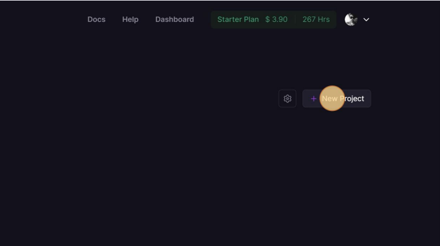

Click en ""Deploy from GitHub repo"

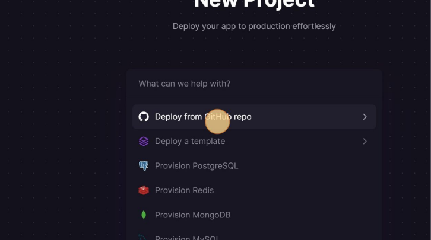

Type "dock[\[enter]]"

Click en "Add variables"

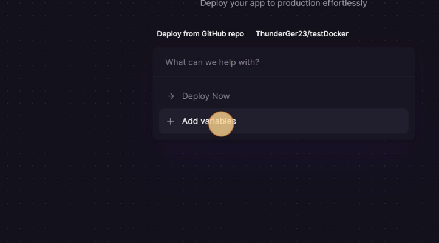

Click en "Add"

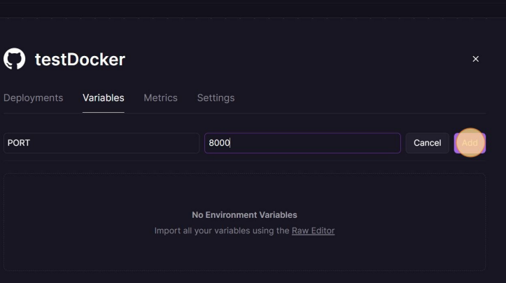

Click en "New Variable"

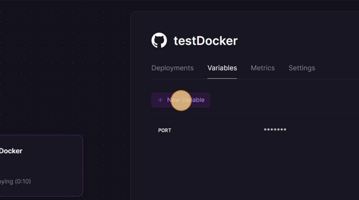

Click en el campo "Value"

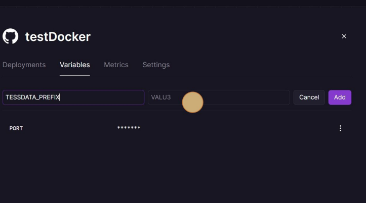

Oprima \[[ctrl]]+\[[V]]

Click en "Add"

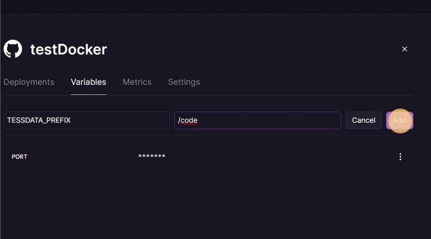

Oprima este icono

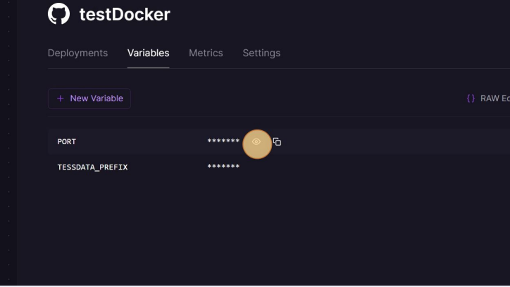

Oprima este boton

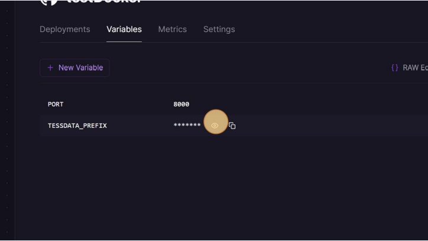

Oprima aqui

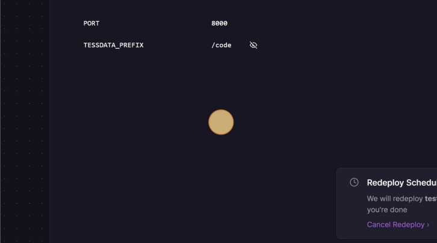

Click en "Settings"

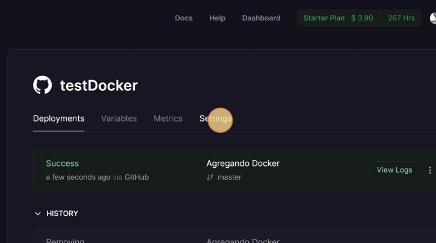

Click en "Generate Domain"

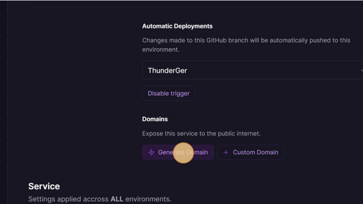

Click en "View Logs"


Click en este icono


Click en "testdocker-production.up.railway.app"

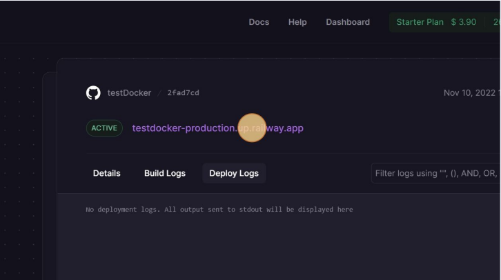

Click en "Testing"


Click en "Try it out"

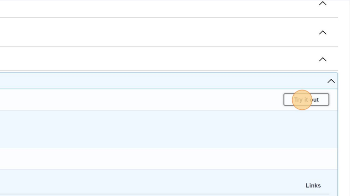

Click en "Execute"

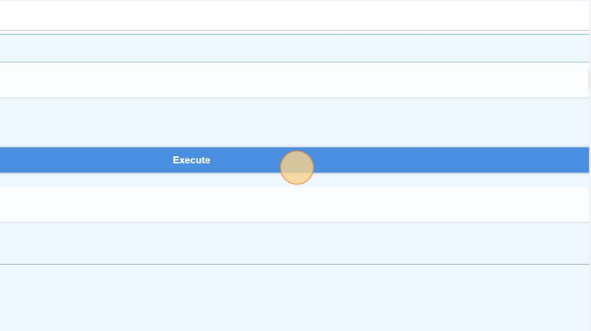

<p align="right">(<a href="#intro">Inicio</a>)</p>

## Construcción🛠️

_El diseño de esta API se realizo en base al siguiente conjunto de tecnologias._

* [Anyio](https://pypi.org/project/anyio/) ➡ Librería de redes y concurrencia asíncrona que funciona sobre asyncio o trio
* [Click](https://pypi.org/project/click/) ➡ Paquete de Python para crear hermosas interfaces de línea de comandos de manera componible con tan poco código como sea necesario
* [Colorama](https://pypi.org/project/colorama/) ➡ Hace que las secuencias de caracteres de escape ANSI (para producir texto de terminal coloreado y posicionamiento del cursor) funcionen bajo MS Windows
* [FastAPI](https://fastapi.tiangolo.com/#installation) ➡ Desarrollo del Servidor
* [H11](https://pypi.org/project/h11/) ➡  Conjunto de herramientas para la construcción de programas que hablan HTTP; h11 hace mucho más fácil implementar algo como requests o twistedweb
* [Idna](https://pypi.org/project/idna/) ➡ Soporte para el protocolo de Nombres de Dominio Internacionalizados en Aplicaciones (IDNA)
* [Pydantic](https://pydantic-docs.helpmanual.io/) ➡ Validación de datos y gestión de configuraciones utilizando sugerencias de tipo de Python
* [Pymongo](https://pymongo.readthedocs.io/en/stable/installation.html) ➡ Distribución de Python que contiene herramientas para trabajar con MongoDB
* [Python 3.10.6](https://www.python.org/) ➡ Lenguaje utilizado
* [Sniffio](https://pypi.org/project/sniffio/) ➡ Pequeño paquete cuyo único propósito es permitirte detectar bajo qué biblioteca asíncrona se está ejecutando tu código
* [Starlette](https://www.starlette.io/) ➡ Framework/toolkit ASGI ligero, ideal para construir servicios web asíncronos en Python
* [Typing_extensions](https://pypi.org/project/typing-extensions/) ➡ Permitir la experimentación con nuevos PEPs del sistema de tipos antes de que sean aceptados y añadidos al módulo de tipado ?
* [Uvicorn](https://www.uvicorn.org/) ➡ Manejo de peticiones HTTP


<p align="right">(<a href="#intro">Inicio</a>)</p>


## Contribuyendo 🖇️

Por favor lee el [CONTRIBUTING.md](https://gist.github.com/villanuevand/xxxxxx) para detalles de nuestro código de conducta, y el proceso para enviarnos pull requests.

<p align="right">(<a href="#intro">Inicio</a>)</p>


## Wiki 📖

Puedes encontrar mucho más de cómo utilizar este proyecto en nuestra [Wiki](https://github.com/ThunderGer23/APICita).

<p align="right">(<a href="#intro">Inicio</a>)</p>


## Versionado 📌

Usamos [SemVer](http://semver.org/) para el versionado. Para todas las versiones disponibles, mira los [tags en este repositorio](https://github.com/ThunderGer23/APICita).

<p align="right">(<a href="#intro">Inicio</a>)</p>


## Autores 🖋

* **ThunderGer** - *Trabajo Inicial* - [ThunderGer23](https://github.com/ThunderGer23)
* **R2D2** - *Documentación* - [R2D2](https://github.com/ArturoEmmanuelToledoAguado)
*  **ItzeGar** - ** - [ItzeGar](https://github.com/itzeGar)

<p align="right">(<a href="#intro">Inicio</a>)</p>


## Licencia 📄

Este proyecto está bajo la Licencia "*MIT*" - mira el archivo [LICENSE](LICENSE) para detalles.

<p align="right">(<a href="#intro">Inicio</a>)</p>


## Expresiones de Gratitud 🎁

**ThunderGer**
<div align="left">
    <table border="0">  
      <tbody>
        <tr>
          <td>
            
          </td>
          <th>
            <li>
              Algun agradecimiento quer agregare despues
            </li>
          </th>
        </tr>
      </tbody>
    </table>
</div>


**R2D2**
<div align="left">
    <table border="0">  
      <tbody>
        <tr>
          <td>
            
          </td>
          <th>
            <li>
              A mis compañeros por brindarme la oportunidad de participar en este proyecto 
            </li>
          </th>
        </tr>
      </tbody>
    </table>
</div>


**ItzeGar**
<div align="left">
    <table border="0">  
      <tbody>
        <tr>
          <td>
            
          </td>
          <th>
            <li>
              Algun agradecimiento quer agregare despues
            </li>
          </th>
        </tr>
      </tbody>
    </table>
</div>

<p align="right">(<a href="#intro">Inicio</a>)</p>